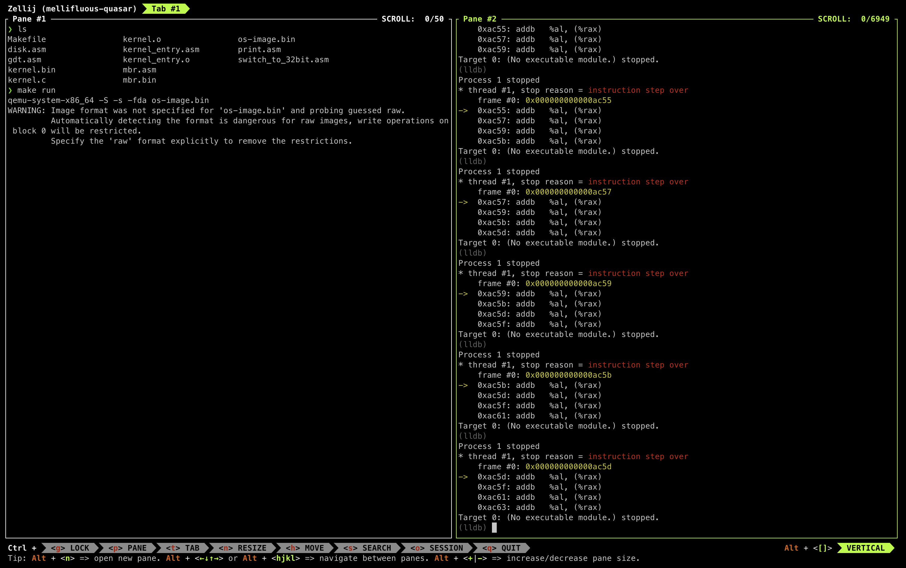
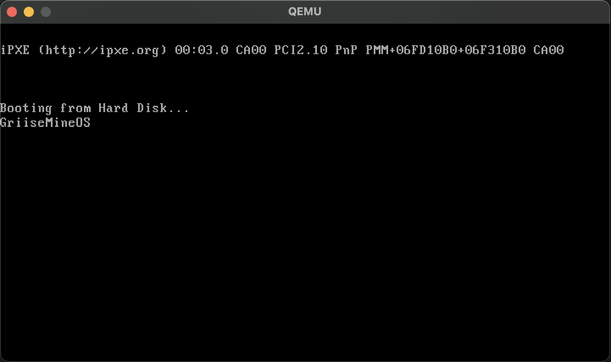

# GriiseMine Bootloader

Dans ce projet, je fais un bootloader en assembleur, qui charge un noyau simple en mode protégé 32 bits. Le bootloader se compose de trois stages, qui sont exécutés successivement par la machine au démarrage :

- Le BIOS, qui est le premier programme chargé à l'adresse 0x7c00. Il lit le premier secteur du disque dur, appelé MBR, qui contient le code du stage 1. Comme le BIOS et le MBR sont limités à 512 octets chacun, ils ne peuvent pas charger le noyau directement.
- Le stage 1, qui lit le disque pour charger le stage 2 à l'adresse 0x1000. Il affiche aussi des messages à l'écran pour indiquer l'avancement du chargement. Comme le stage 1 est toujours en mode réel 16 bits, il ne peut pas accéder à plus de 1 Mo de mémoire.
- Le stage 2, qui passe en mode protégé 32 bits en initialisant la GDT et en modifiant le registre CR0. Il appelle ensuite le kernel, qui est écrit en C et qui est chargé à l'adresse 0x10000.
- Le kernel, qui affiche un 'X' à l'écran, en utilisant la mémoire vidéo à l'adresse 0xb8000. C'est le début du système d'exploitation, qui peut être développé pour ajouter des fonctionnalités plus avancées.


## Prérequis

Pour compiler et exécuter ce projet, vous avez besoin des outils suivants :

- Un compilateur C, comme gcc ou clang
- Un assembleur, comme nasm ou gas
- Un éditeur de liens, comme ld
- Un émulateur de machine virtuelle, comme qemu

## Installation

Pour cloner ce dépôt, utilisez la commande :

```shell
git clone https://github.com/griisemine/GriiseMineBootloader.git
```

Pour compiler le projet, utilisez le Makefile fourni :

```shell
make
```

Pour exécuter le projet, utilisez la commande :

```shell
make run
```

## Exemple d'utilisation

Outil de débogage que j’ai utilisé pour analyser le comportement de mon code. D’un côté, j’ai lancé qemu avec les options -s et -S, qui permettent de lancer un serveur gdb sur le port 1234 et de mettre en pause l’exécution du système. De l’autre, je me suis connecté au serveur gdb depuis lldb



On voit l’écran qui s’affiche lors du démarrage du système, avec le nom GriiseMineOS. Cet écran a été réalisé en utilisant les fonctions du BIOS et les interruptions, qui permettent de communiquer avec les périphériques comme le clavier ou l’écran. Le BIOS est le premier programme exécuté par la machine, et il lit le premier secteur du disque dur, appelé MBR, qui contient le code du stage 1 du bootloader.



## Documentation technique

Ce projet s’inspire principalement de [OSDev.org], un site web en anglais qui regroupe de nombreuses ressources sur le développement de systèmes d’exploitation, notamment des tutoriels, des exemples de code et des forums.

Dans ce projet, j’ai rencontré plusieurs difficultés et j’ai dû chercher des solutions pour les surmonter. Par exemple, j’ai dû comprendre comment utiliser les interruptions BIOS pour lire le disque, comment initialiser la GDT pour passer en mode protégé, comment appeler du code C depuis de l’assembleur, etc. J’ai aussi dû apprendre à utiliser des outils de débogage, comme gdb, pour analyser le comportement de mon code. Pour cela, j’ai utilisé les options -s et -S de qemu, qui permettent de lancer un serveur gdb sur le port 1234 et de mettre en pause l’exécution du système. J’ai ensuite pu me connecter au serveur gdb avec la commande :

```shell
gdb -ex 'target remote localhost:1234' -ex 'symbol-file kernel.bin'
```

J'ai ainsi pu inspecter les registres, la mémoire, les instructions, les points d'arrêt, etc.

